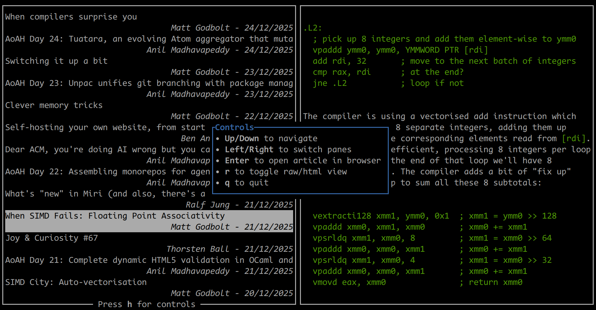

# Terminal-based RSS Aggregator

Add your own feeds in `feeds.txt`.

### Features

- Rendering of simple HTML
- Local caching of feeds for faster startup
- Resize panes using the mouse, by dragging the middle separator
